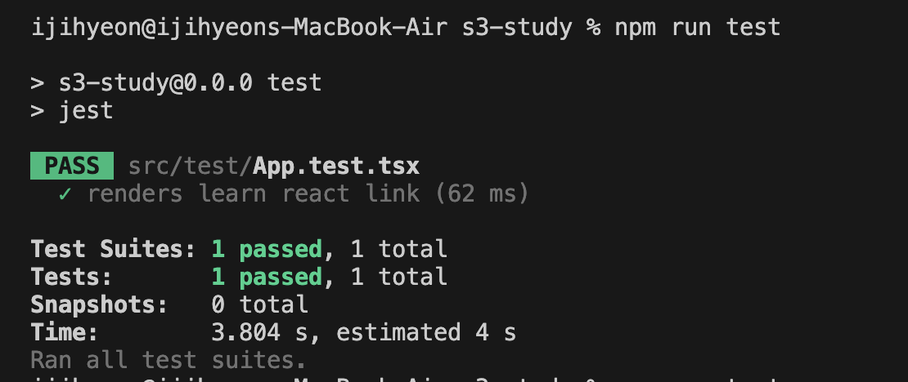

# AWS S3 배포 CI/CD

[배포 사이트](http://test-s3-dam.s3-website.ap-northeast-2.amazonaws.com/)

- CI (Continuous Integration) : 코드의 지속적인 통합하는 것을 이상으로 유효한 코드인지 검사.
- CD (Continuous Delivery/Deployment) : CI과정을 통해서 성공적으로 통합된 코드를 배포.

  - Continuous Delivery : 개발환경의 배포까지 자동화 된 것.
  - Continuous Deployment : 실제 사용자에게 제공되는 Production 환경에 배포를 자동화 한 것.

- 클라우드형 CI/CD 플랫폼인 GitHub Actions 사용.
  - CI/CD 플랫폼을 운영할 컴퓨터를 개발자가 직접 관리할 필요없이 서비스 제공자가 클라우드에서 모두 운영해주는 형태
  - CI/CD 파이프라인의 구축에만 신경 쓸 수 있음. (반대의 경우는 설치형:Jenkins)
  - [GitHub Actions 공식문서](https://docs.github.com/en/actions/learn-github-actions/understanding-github-actions)

## 1. AWS S3 버킷

정적 웹사이트 리액트를 S3를 통해서 호스팅하기.

- 스크립트로 버킷을 접근하기 위해서 AWS command line interface 설치 필요

  AWS의 S3버킷에 존재하는 기존읠 자료의 삭제하고 새로운 파일을 업로드하는 것은 너무 번거로움.

- 단순하게 script에서 cli로 배포
  `aws s3 sync dist/ s3://test-s3-dam --delete`<br/>
  : aws s3에다가 dist/ 경로내에 존재하는 파일을 `s3://test-s3-dam` 버킷에, 이전에 업로드된 파일은 지우고 업로드 해달라.

CD로 배포시킨다면?

## 2. GitHub Actions 기본 설정

내가 지정하는 브랜치에 push되는 코드에 적용시키기

`.github/workflows` 폴더에 원하는 `.yml` 파일 생성

```yml
name: CI/CD
on:
  push:
    branch:
      - master

job:
  cicd:
    runs-on: ubuntu-latest
    steps:
      - run: echo hello,cicd
```

- **push** : push 되었을대 실행하겠다는 의미
- **branch** : 어떤 브랜치에 일어났을 때 실행 시킬 것인지
- **job** : job 단위로 실행
- **job > cicd** : job 이름을 cicd로 지정
- **runs-on** : 최신 우분투 위에서 job을 실행 시킴
- **steps** : 무엇을 실행할건지

master 브랜치에 코드 푸쉬가 일어날 경우, yml 파일을 읽어서 cicd job 이 동작한다.
성공할 경우, `hello,cicd` 표시.

<p align="center">

</p>

## 3. Github Actions로 CI 구축 해보기

기본적으로 테스트 코드를 동작시키기 위해서 CI를 사용한다.
테스트 환경 구축하기.

### vite에서 테스트 환경 구축하기

CRA에는 기본적으로 설치되어있지만 vite에는 없다.
해당 블로그를 참조하여 세팅을 했다. : [참고한 블로그 글](https://marshallku.com/dev/react-%ed%85%8c%ec%8a%a4%ed%8a%b8-%ed%99%98%ea%b2%bd-%ea%b5%ac%ec%b6%95%ed%95%98%ea%b8%b0)

#### 1) 필요한 패키지 설치

현재 필요한 부분만 설치 (전체적으로 설치원할 경우, 참고한 블로그 참고하기)

`npm i -D jest ts-jest @testing-library/react @testing-library/jest-dom @testing-library/user-event identity-obj-proxy`

#### 2) package.json

테스트를 실행 시킬 script 추가

```json
"scripts": {
    "test": "jest"
},
```

#### 3) jest.config.json

root에서 부터 테스트 코드를 파일을 찾으러간다.
root 디렉토리내의 `jest.setup.ts` 은 각 테스트 파일 실행 이후에 실행된다.
(경로는 원하는대로 설정)

```json
{
  "roots": ["<rootDir>"],
  "testMatch": ["**/*.test.ts?(x)"],
  "testEnvironment": "jsdom",
  "moduleNameMapper": {
    "\\.(css|less|svg)$": "identity-obj-proxy"
  },
  "setupFilesAfterEnv": ["<rootDir>/jest.setup.ts"],
  "transform": {
    "^.+\\.tsx?$": "ts-jest"
  }
}
```

#### 4) jest.setup.ts

DOM의 상태를 테스트하려면 jest-dom 이 필요

```ts
import "@testing-library/jest-dom";
```

다른 블로그들에 `import "@testing-library/jest-dom/extend-expect";` 를 import 해오던데, 처음에는 그거 따라서 해보니깐 존재하지않는다고 계속 에러를 띄워줘서 Testing Library 공식 홈페이지 가보니, [svelte 셋업](https://testing-library.com/docs/svelte-testing-library/setup#jest)에서 설치하는 내용이었다.

#### 5) 코드 작성

AWS S3 CICD 학습용이기 때문에 간단한 코드 작성.

`npm run test`로 테스트를 동작시켜 pass 된 결과 확인

<p align="center">

</p>

아, 그럼~ yml에 해당 테스트 코드를 동작시키게끔 적용 하기!

```yml
name: CI/CD

on:
  push:
    branches:
      - main

jobs:
  cicd:
    runs-on: ubuntu-latest
    steps:
      - uses: actions/checkout@v3
        with:
          ref: "main"
      - run: npm ci
      - run: npm run test
      - run: echo "success"
```

성공한 것을 확인 할 수 있다.

<p align="center">

</p>

## 4. Github Actions로 DI 구축 해보기

### Github Marketplace 에서 만들어진 Actions 가져오기

설정한 S3 버킷에다가 업로드를 해주는 actions를 npm package 처럼 만들어진 actions를 가져와 사용할 수 있다.
패키지 선정기준과 동일하게, star가 많고 사용자수가 많으면서 유지보수가 되고있으며 에러 이슈가 적은것으로 선정한다.


일단, [S3 Sync](https://github.com/marketplace/actions/s3-sync)을 사용

기재된 github action의 설명에 따라 설정한다. S3 관련 정보는 `secrets`을 사용해야한다.

### S3에 대한 시크릿

해당 레포지토리 Settings > Secret and variables > actions > New repository secret 을 통해서 나의 S3에 대한 시크릿 만들기.
`.env` 파일은 깃 이그노어로 레포지토리에 올리지 않는다. 또한, 실제로 깃허브가 읽을 수 없기 때문에 secrets 를 통해 actions에 전달한다.

<p align="center">

</p>

해당 action에 따라 CD를 적용시킨 yml 파일

```yml
name: CI/CD

on:
  push:
    branches:
      - main

jobs:
  cicd:
    runs-on: ubuntu-latest
    steps:
      - uses: actions/checkout@v3
        with:
          ref: "main"
      - run: npm ci
      - run: npm run test
      - run: npm run build
      - name: deploy to s3
        uses: jakejarvis/s3-sync-action@master
        with:
          args: --delete
        env:
          AWS_S3_BUCKET: ${{ secrets.AWS_S3_BUCKET }}
          AWS_ACCESS_KEY_ID: ${{ secrets.AWS_ACCESS_KEY_ID }}
          AWS_SECRET_ACCESS_KEY: ${{ secrets.AWS_SECRET_ACCESS_KEY }}
          AWS_REGION: "ap-northeast-2"
          SOURCE_DIR: "dist"
```

with 의 args는 s3 cli를 실행 시킬때 넣어주는 [옵션](https://docs.aws.amazon.com/cli/latest/reference/s3/sync.html#options)을 추가해주면 된다.
코드 푸시할 경우 이전에 업로드 했던 파일 삭제하기위해 추가.

settings에서 추가해두었던 secrets들을 yml 파일에서 불러온다.
AWS_REGION 는 S3 버킷 만들때 설정한 것으로 동일하게 설정.
vite의 빌드 파일들은 `dist`에 만들어지기 때문에 SOURCE_DIR 는 CRA의 설정과 달리 해줘야한다.

<p align="center">

</p>
성공적으로 배포되는 것을 확인 할 수 있다.
코드 변경시, 바로 반영된다.

[배포 사이트](http://test-s3-dam.s3-website.ap-northeast-2.amazonaws.com/)

---

추가적인 학습은 다음 시간에......ㅎ
